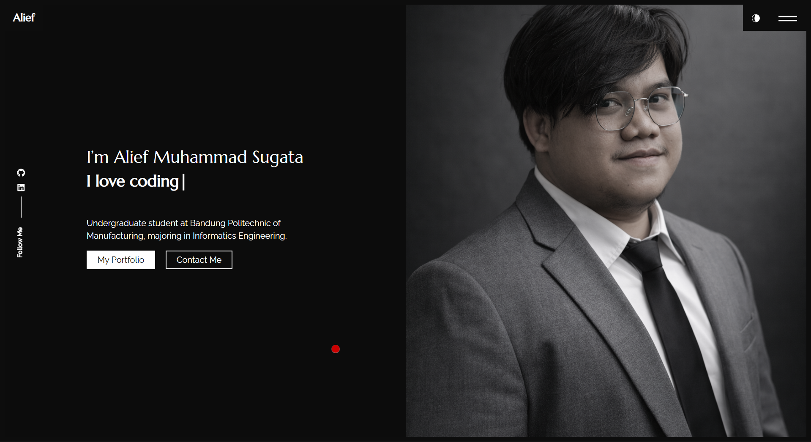

#  Alief Muhammad Sugata — Portfolio

Personal portfolio website built with **React.js** to showcase my projects, skills, and experience in **Web Development** and **Cyber Security**.

## 🔗 Live Demo
👉 https://alief-portfolio.vercel.app/

##  Preview

##  Tech Stack
-  React (Create React App)
-  CSS / Bootstrap
-  React Router
-  Typewriter Effect
-  Deployed on Vercel

## Features
- Responsive modern UI
- Portfolio gallery with popup detail
- Dynamic content from single config file
- SEO friendly with React Helmet
- Fast deployment with Vercel

##  About Me
I am an Informatics Engineering student at **Politeknik Manufaktur Bandung** with a strong interest in **Web Development** and **Cyber Security**.

I enjoy building clean, functional applications and continuously learning about system security and modern technologies.

##  Contact
- Email: aliefmuhammad916@gmail.com
- LinkedIn: https://www.linkedin.com/in/aliefmuhammadsugata/
- GitHub: https://github.com/Lief404

##  License
This project is licensed under the MIT License.
